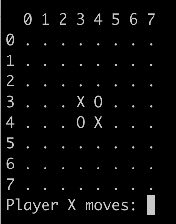

# Othello-Game
Simple implementation of the two player game Othello

A makefile is provided for easy compilation and clean up.

To place your disk enter the coordinates of the desired location. First the Row then the Column.

For the GUI version just click the desired cell.
Up to two player names can be passed as arguments. If no names are passed it defaults to Black/White player.

