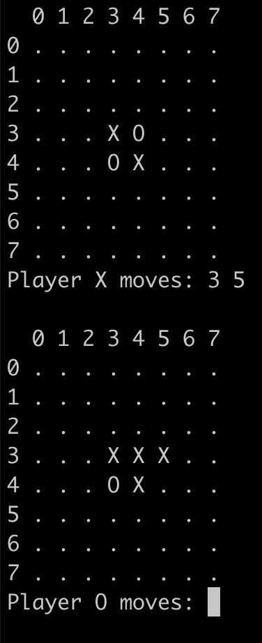

# Simple-Othello-Game
Simple implementation of the two player game Othello

A makefile is provided for easy compilation and clean up.

After executing the games begins.

To place your disk enter the coordinates of the desired location. First the Row then the Column.

